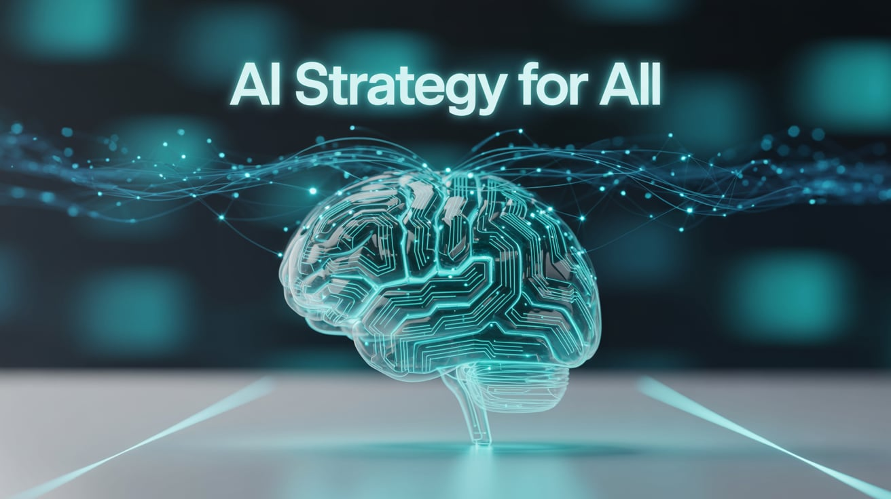

# AI-Strategy-for-All
AI Strategy for ALL is a global open-source initiative aimed at democratizing access to effective and ethical AI strategies. This comprehensive playbook brings together cutting-edge frameworks, strategic templates, datasets, and real-world use cases to help you design, implement, and scale AI solutions across industries. Whether you're shaping public policy, leading digital transformation, or building the next AI startup, AI Strategy for ALL equips you with the knowledge and tools to lead with purpose and precision.

## 🌍 Key Initiative: AI for All

### 🚀 *AI for All – Making AI Accessible to Everyone*

**AI for All** is my flagship global initiative committed to making AI knowledge accessible to everyone, empowering people from all backgrounds, locations, and walks of life to unlock the potential of artificial intelligence and create a better future.

🔹 **What it offers:**

- Free, open-source AI learning resources  
- Community-driven mentorship & support  
- Real-world projects with **Generative AI**, **AI agents**, and more  
- Special focus on empowering **Saudi men and women**, especially **Saudi women in tech**  
- 17 comprehensive tracks including Women in AI, Quantum AI, AI Ethics, and more

🔗 Learn more and join the movement: [drdebashisdutta.com/ai-for-all](https://drdebashisdutta.com/ai-for-all)

# 🌍 AI Strategy for All

Welcome to **AI Strategy for ALL** — the ultimate hub for everything related to AI-driven strategy. Whether you're a researcher, developer, policymaker, or tech enthusiast, this is your one-stop destination to explore, learn, and build with actionable, ethical, and future-ready AI strategies.

## 🚀 What is "AI Strategy for All"?

**AI Strategy for ALL** is a global open-source initiative aimed at democratizing access to effective and ethical AI strategies. This comprehensive playbook brings together cutting-edge frameworks, strategic templates, datasets, and real-world use cases to help you design, implement, and scale AI solutions across industries. Whether you're shaping public policy, leading digital transformation, or building the next AI startup, AI Strategy for ALL equips you with the knowledge and tools to lead with purpose and precision.

## 📚 What's Inside?
 
- 📘 **Strategy Frameworks & Playbooks** – Explore curated models, roadmaps, and templates to design effective AI strategies
- ⚙️ **Governance & Responsible AI Tools** – Access open-source tools for AI ethics, policy alignment, and risk management
- 📊 **Sector-Specific Case Studies** – Learn from real-world AI strategy implementations across healthcare, finance, education, and more
- 📈 **Implementation Guides** – Step-by-step blueprints for operationalizing AI across enterprises and public institutions
- 🎓 **Courses & Learning Tracks** – Upskill with guided content on strategic AI planning, adoption, and leadership
- 🌐 **Latest Insights & Trends** – Stay updated with evolving global AI policies, research, and best practices

## 💡 How to Use This Repository

### 🔍 Explore  
Browse the structured sections to find what you need — whether it's to **use**, **learn**, or **build** your own AI agent.

### 🤝 Contribute  
Share your tools, code, workflows, or ideas to grow the AI agent community. Open a pull request or suggest additions!

### 📢 Stay Updated  
Follow this repo for the latest in AI strategy, governance frameworks, ethical deployment models, and cross-sector implementation guides. Join the conversation and collaborate with global contributors shaping the future of responsible and impactful AI.

---

## 🌟 Why "AI Strategy for All"?

Because we believe the future of AI should be **open, ethical, and accessible to all** — from budding Streagy professionals, developers and students to enterprises and governments.

> Let’s build a thriving, inclusive ecosystem for strategic, responsible, and impactful AI — together.

---

⭐ **Star this repo** if you find it helpful!  
📬 Join the movement. Contribute. Collaborate. Create.

#AI #OpenSource #AIforAll #AIStrategyForAll

## Using

Every day, organizations are redefining how they operate by integrating AI—not just as a tool, but as a core strategic asset. AI Strategy for ALL brings you a curated collection of essential resources, playbooks, and frameworks to help you lead this transformation with clarity and confidence.

Whether you're crafting a national AI policy, leading enterprise innovation, or building AI-driven services, these strategic assets will guide you through every stage—from vision to execution. From smarter decision-making and ethical deployment to scalable infrastructure and governance models, there's a strategy here ready to empower your next move.

This is just a glimpse into the expanding landscape of AI strategy that’s shaping the future of industries, governments, and societies. Dive in and explore what’s possible when strategy meets intelligence.

---

## Learning
Here’s how you can grow your AI agent skills:  
- **For Beginners** - Start with the basics! Discover what AI Strategy is and how it works, one step at a time. A course will be launched shortly to guide you through it all.  
- **For the Curious** - Dive in and explore techniques you need to build your own fully implementable AI Strategy.A course will be launched shortly to guide you through it all.
- **For the Bold** - Explore advanced topics like Globally accepted innovative AI Strategy, cutting-edge playbook. A course will be launched shortly to guide you through it all.

---

# 🌐 AI Strategy for ALL – The Ultimate AI Playbook Repository

Welcome to **AI Strategy for ALL** — a global open-source initiative to democratize access to strategic, responsible, and high-impact AI implementation. Whether you're building agentic solutions, leading digital transformation, or navigating the GenAI revolution — this is your go-to hub for frameworks, playbooks, and strategic guidance.

## 📘 16 Powerful AI Strategy Playbooks Everyone Should Know About

From Microsoft and Google to McKinsey and Deloitte, the following curated resources offer essential insights for enterprises, innovators, and governments shaping the future of AI.

> ✅ Perfect for: AI Leaders, Policymakers, Developers, Strategists, Founders, CTOs, and Change Agents.

---

### 🔠 Listed Alphabetically:

1. **Accenture – The Art of AI Maturity**  
   📎 [Read it here](https://www.accenture.com/us-en/insights/artificial-intelligence/ai-maturity-and-transformation)

2. **Amazon – AI/ML/GenAI Cloud Framework**  
   📎 [Read it here](https://docs.aws.amazon.com/whitepapers/latest/aws-caf-for-ai/aws-caf-for-ai.html)

3. **Bain & Company – Transforming CX with AI**  
   📎 [Read it here](https://www.bain.com/insights/transforming-customer-experience-with-ai-a-guide-to-sustainable-growth-webinar/)

4. **Bain – Winning with AI**  
   📎 [Read it here](https://www.bain.com/insights/winning-with-ai-five-questions-for-every-ceo/)

5. **Booz Allen – Securing AI**  
   📎 [Read it here](https://www.boozallen.com/insights/ai-research/securing-artificial-intelligence.html)

6. **Boston Consulting Group (BCG) – Transforming with AI**  
   📎 [Read it here](https://www.bcg.com/featured-insights/the-leaders-guide-to-transforming-with-ai)

7. **Deloitte – AI Transformation**  
   📎 [Read it here](https://www.deloitte.com/content/dam/Deloitte/us/Documents/deloitte-analytics/us-ai-institute-state-of-ai-fifth-edition.pdf)

8. **Google – AI Adoption Framework**  
   📎 [Read it here](https://cloud.google.com/resources/cloud-ai-adoption-framework-whitepaper)

9. **IBM – CEO’s Guide to GenAI**  
   📎 [Read it here](https://www.ibm.com/thought-leadership/institute-business-value/en-us/report/ceo-generative-ai)

10. **McKinsey & Company – The Executive’s AI Playbook**  
    📎 [Read it here](https://www.mckinsey.com/capabilities/quantumblack/our-insights/the-executives-ai-playbook)

11. **Microsoft – CIO’s GenAI Playbook**  
    📎 [Read it here](https://techcommunity.microsoft.com/blog/microsoft365copilotblog/rewriting-the-it-playbook-empowering-cios-to-lead-with-confidence-in-the-ai-era/4411734)

12. **Project Management Institute – DS/AI Project Playbook**  
    📎 [Read it here](https://www.pmi.org/learning/library/playbook-data-science-artificial-intelligence-projects-13322)

13. **PwC – Agentic AI Playbook**  
    📎 [Read it here](https://www.pwc.com/m1/en/publications/documents/2024/agentic-ai-the-new-frontier-in-genai-an-executive-playbook.pdf)

14. **PwC & Microsoft – Deploying AI at Scale**  
    📎 [Read it here](https://www.pwc.com/ua/en/survey/2024/how-to-deploy-ai-at-scale.html)

15. **Scaled Agile – AI-Augmented Workforce**  
    📎 [Read it here](https://framework.scaledagile.com/ai-augmented-workforce-a-leaders-guide-to-unleashing-human-potential)

16. **World Economic Forum – AI C‑Suite Toolkit**  
    📎 [Read it here](https://www.weforum.org/publications/empowering-ai-leadership-ai-c-suite-toolkit/)

---

## Contributing

💡 Contributions are welcome!  

Feel free to submit a pull request, suggest a new resource, or [open an issue](https://github.com/drdebashisdutta/AI-Agents-for-All for All/issues/new). 

Make sure your submissions align with the following guidelines:

- Relevance to AI Strategy (e.g. category - Strategy, Framework, Case studies)
- Clear documentation and accessibility (e.g. name + link + 1 sentence description).

---

## Spread the Word

📢 Help us grow the **AI Strategy for All** community by sharing this repo with your network! 

You can star the repo, and share on LinkedIn and/or Twitter. 

More info on how to do this below.

### ⭐ Star the repo ⭐
⭐ **Why Star This Repository?**  
Your star helps others find this valuable resource! By starring, you:  
- Support the AI agents community.  
- Gain access to the freshest content updated **every 24 hours**.  
- Inspire others to dive into the world of intelligent systems.  

Let’s make AI for ALL! 🌟 

### 🙏 Credits

This project was inspired part by amazing collection curated by  [Martin Vonderheiden](https://www.linkedin.com/in/vonderheiden/) . Big thanks for curating such a valuable list of AI strategy resources!

### LinkedIn
Share on LinkedIn with this simple post:

> 🚀 **AI Strategy for All** - A curated collection of cutting-edge resources in the world of AI strategies. Open-source, community-driven, and ready to help spread AI for All! 
> 🔗 [Check it out here!](https://github.com/drdebashisdutta/AI-Strategy-For-All)  
> #AI #AIStrategy #MachineLearning #Automation #OpenSource #ArtificialIntelligence #DataScience #Innovation

[Click here to share on LinkedIn!](https://www.linkedin.com/sharing/share-offsite/?url=https://github.com/drdebashisdutta/AI-Strategy-For-All)

### Twitter
Tweet this to share on Twitter:

> 🚀 Discover the **AI Strategy for All** repo! 🤖 A curated collection of AI agents for automation, NLP, and more! Open-source & community-driven! 🌟  
> 🔗 [Check it out here!](https://github.com/drdebashisdutta/AI-Strategy-For-All)  
> #AI #AIStrategy #MachineLearning #Automation #OpenSource #ArtificialIntelligence #Innovation

[Click here to tweet!](https://twitter.com/intent/tweet?text=Check+out+this+global+open-source+initiative%3A+AI+Strategy+for+ALL+%F0%9F%96%A5%EF%B8%8F%E2%9C%A8+Democratizing+AI+strategy+with+frameworks%2C+playbooks%2C+and+real-world+guides+for+everyone.+%23AI+%23GenAI+%23AIstrategy&url=https%3A%2F%2Fgithub.com%2Fdrdebashisdutta%2FAI-Strategy-For-All)

## License

📜 This repository is licensed under the [Apache 2.0](LICENSE).  

Proudly open source to benefit the larger community, feel free to fork and extend!
